# react2025q3

Before Optimization:

1. Sorting

- Commit Duration: 436.6ms
- Render Duration: 415.5ms
- Flame Graph: Visual representation of component render times.
  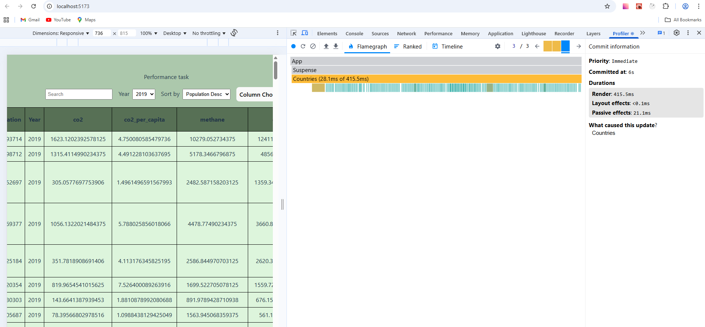
- Ranked Chart: Sorted list of components by render duration.
  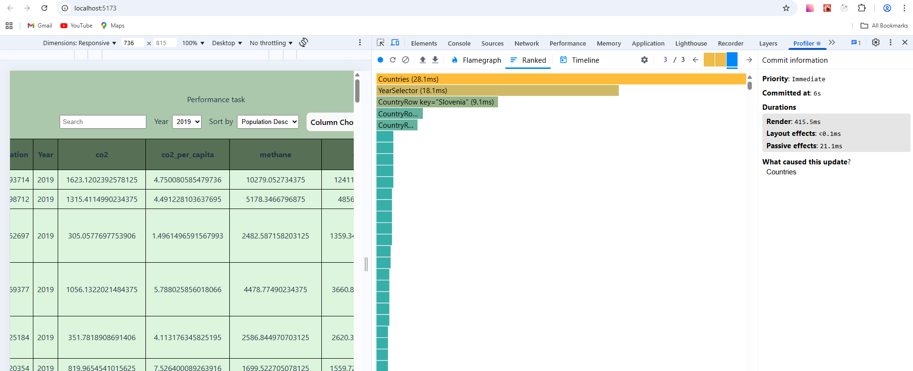

2. Year Selection

- Commit Duration:286,1ms
- Render Duration: 271.4ms
- Flame Graph: Visual representation of component render times.
  
- Ranked Chart: Sorted list of components by render duration.
  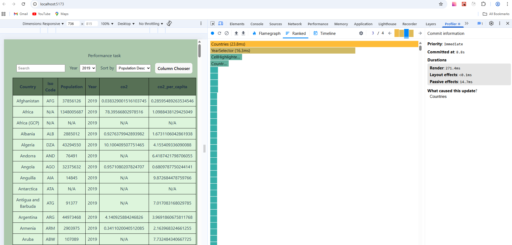

3. Column Selection

- Commit Duration: 440.4ms
- Render Duration: 414.2ms
- Flame Graph: Visual representation of component render times.
  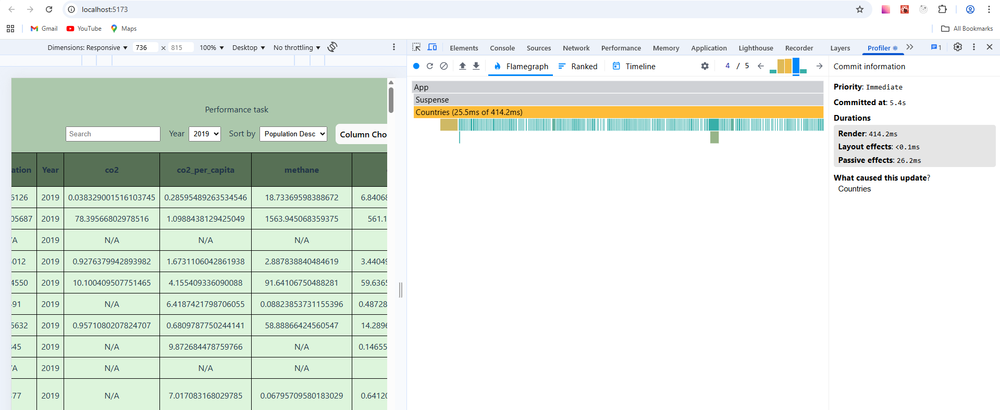
- Ranked Chart: Sorted list of components by render duration.
  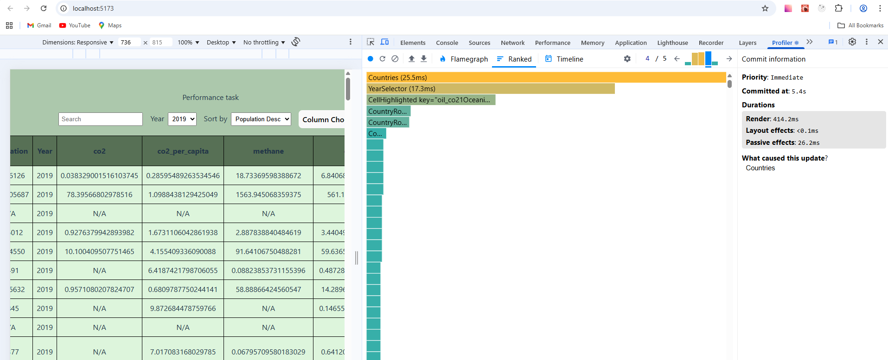

4. Search

- Commit Duration: 72.1ms
- Render Duration: 70ms
- Flame Graph: Visual representation of component render times.
  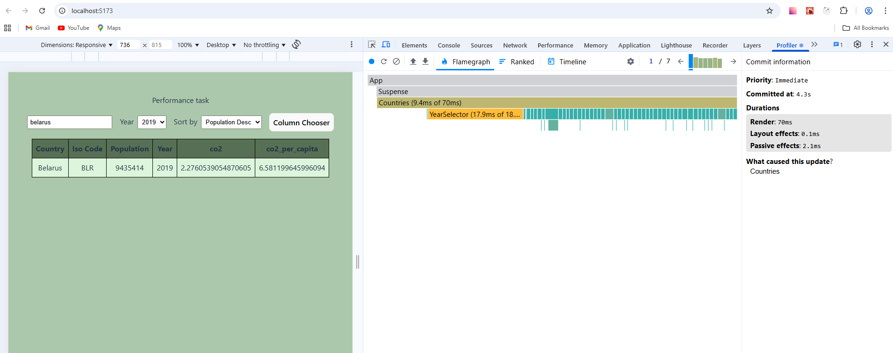

Based on analysis columns selection and sorting take more time than other operations.
Apart from that, it's visible from charts that YearSelector re-renders when Sorting, search, column selection is occurred.

After optimization:
1. Sorting

- Commit Duration: 23.2ms
- Render Duration: 23.2ms
- Flame Graph: Visual representation of component render times.
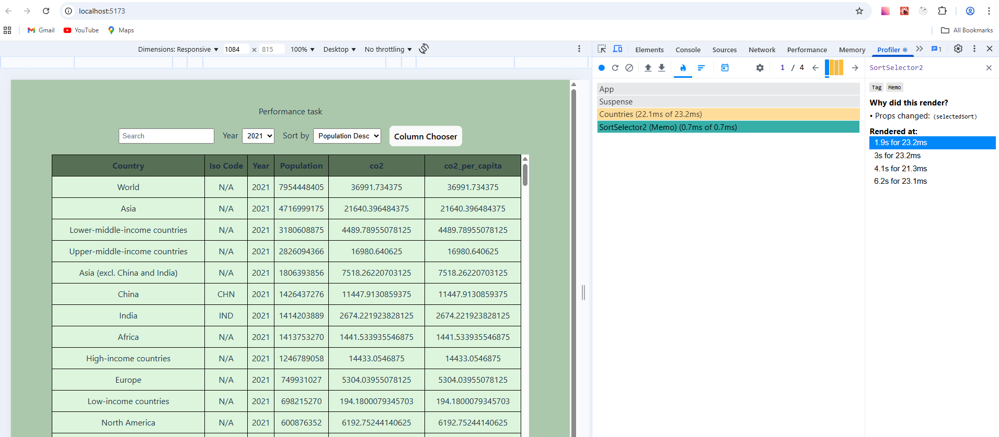
- Ranked Chart: Sorted list of components by render duration.
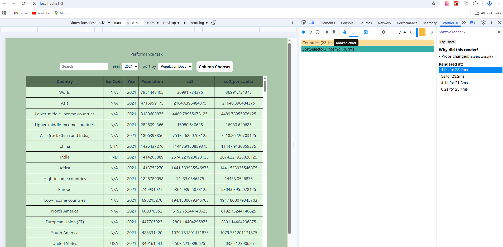

2. Year Selection

- Commit Duration:282.7ms
- Render Duration: 269.8ms
- Flame Graph: Visual representation of component render times.
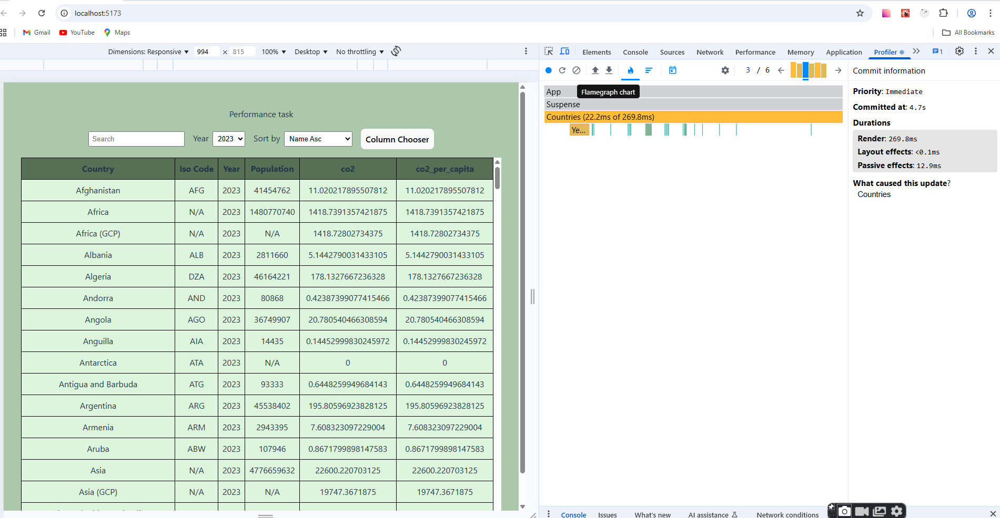
- Ranked Chart: Sorted list of components by render duration.
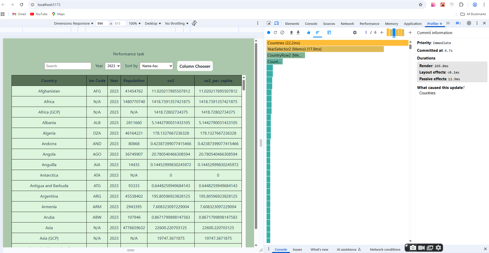

3. Column Selection

- Commit Duration: 429.2ms
- Render Duration: 409.7ms
- Flame Graph: Visual representation of component render times.
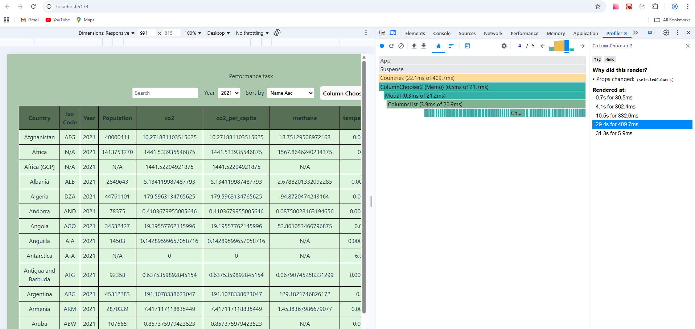
- Ranked Chart: Sorted list of components by render duration.
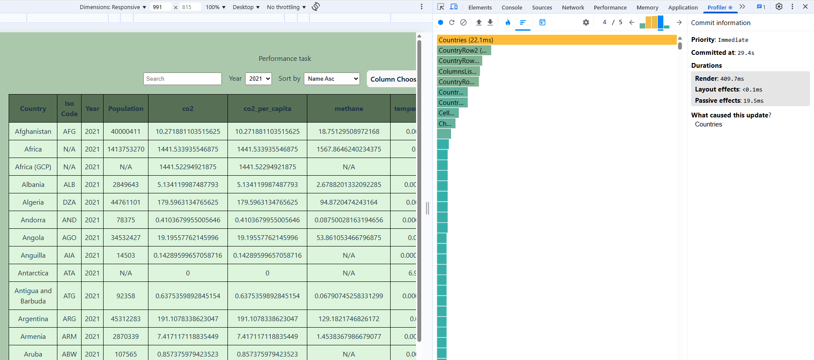

4. Search

- Commit Duration: 7.2ms
- Render Duration: 7.2ms
- Flame Graph: Visual representation of component render times.
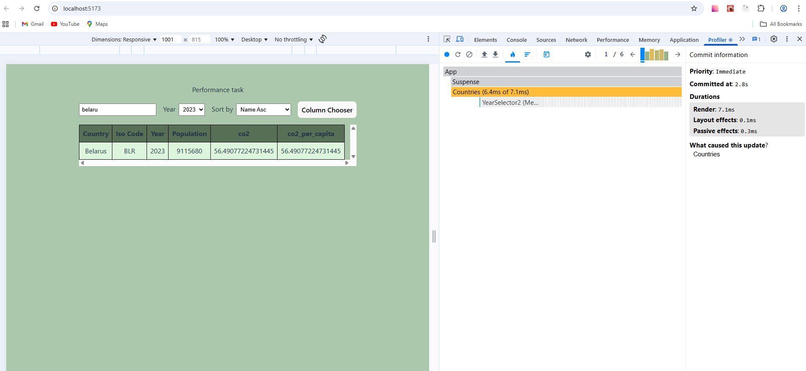
- Ranked Chart: Sorted list of components by render duration.
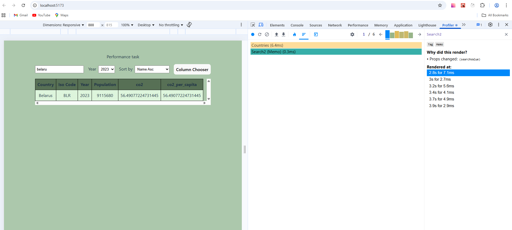

As a result of optimization, render and commit duration are decreased significantly for Sorting and Search operations.
For Columns selection, rendering duration was decreased on 4.5ms, for Year Selection - 1.6ms.
From charts analysis it's noticed that YearSelector component is not re-rendered during operations where YearSelector is not involved.
